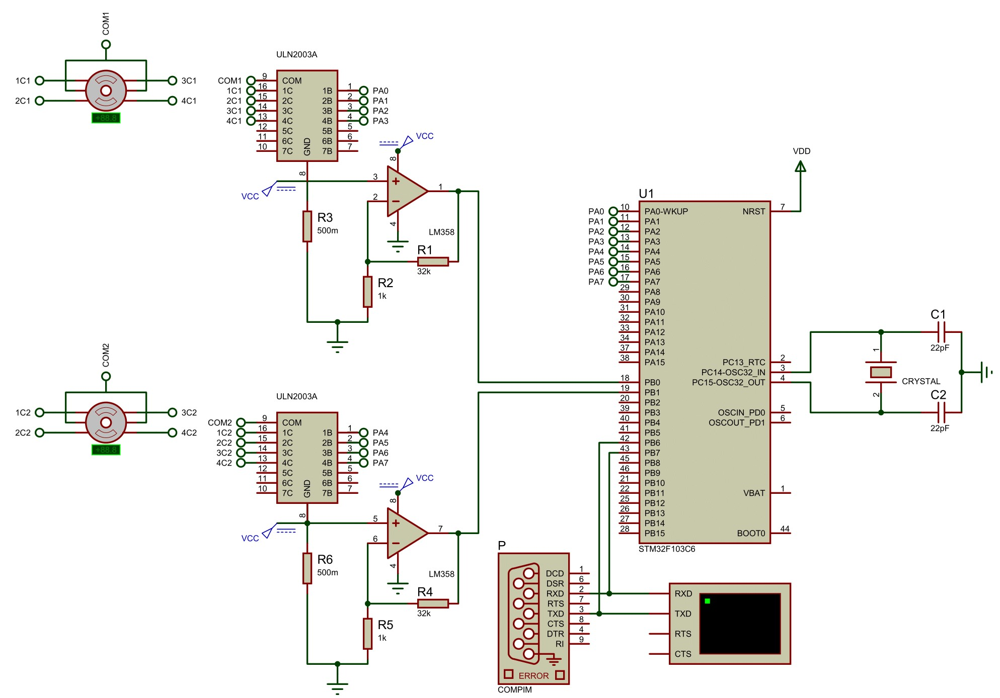

# **Robot - Wrist**

## **Sistemas Microprocessados**

### Professor: Ricardo Jardel Nunes da Silveira

### Equipe:

- Dariel Bezerra de Sousa - Matrícula: 495208.
- Felipe Paiva Alencar - Matrícula: 494543.

---

Robot - Wrist Project :

Desenvolvimento de um robô de pulso utilizando a bluepill e o esquemático por meio do simulador Proteus. 

Implementou-se o código necessário sem a utilização do software STM32CUBE IDE, priorizando-se os periféricos e configurações utilizados na construção do robô de pulso: USART, ADC e TIMER.

A imagem abaixo ilustra o esquemático elaborado no proteus.

Ao analisar o circuito acima, observa-se a utilização do microcontrolador STM32F103C6, de dois motores stepper, dois comoponentes ULN2003A, dois amplificadores operacionais, resistores, uma porta USART, duas portas ADC, fonte de tensão constante de 5 V, dois capacitores e um crystal para a determinação do sinal de clock.

