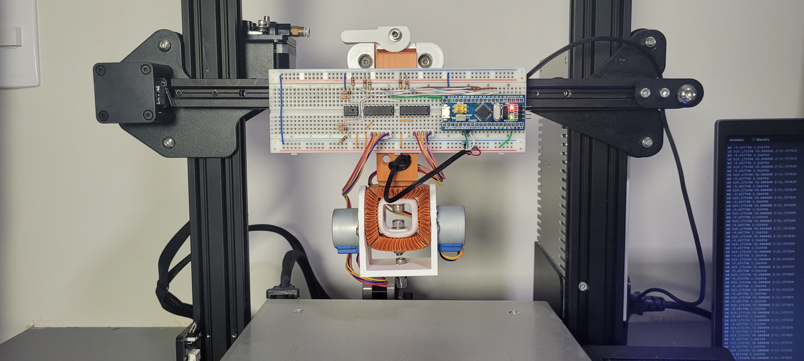

# robot-wrist

## About

The robot-wrist is a robot that (tries to) mimic the movement of a human wrist
(and forearm). In addition to developing the robot itself, it also was 
integrated with a 3D printer and a PS4 controller to demonstrate a usage case.

Furthermore, it is the final project of the discipline of Microprocessed Systems
taught by Professor Ricardo Jardel Nunes da Silveira from the Federal University
of Ceará (UFC).

## Authors

- Dariel Bezerra de Sousa (495208)
- Felipe Paiva Alencar (494543).

## Summary
- [Controller](controller/)
- [Firmware](firmware/)
- [OpenSCAD (3D Model)](openscad/)
- [Proteus (Schematic)](proteus)

## Video

