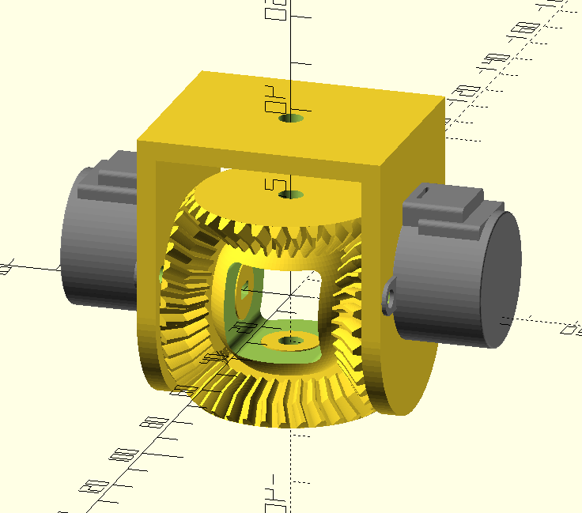
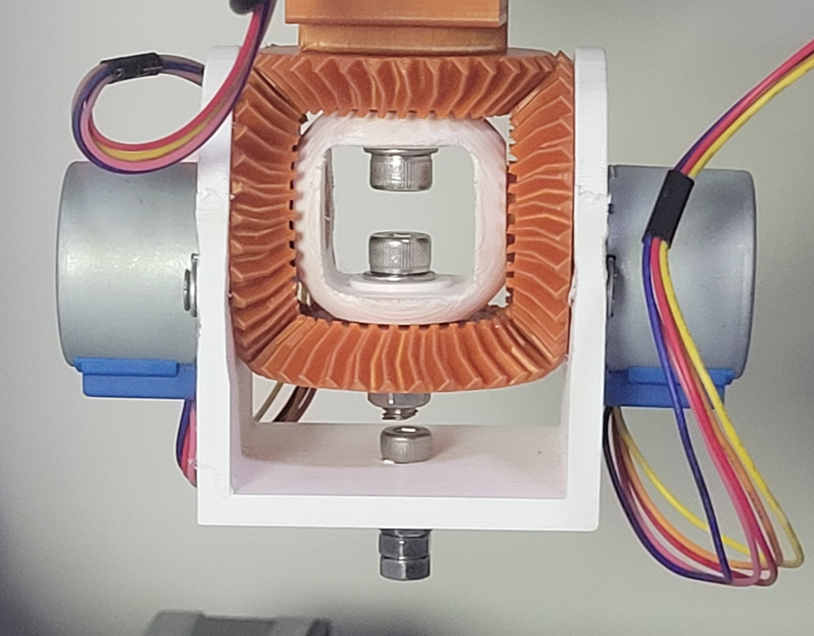

# OpenSCAD

3D model for a robot that mimics the movement of a human wrist (and forearm) 
with a spur-gear differential. This 3D model, basically, is a scaled down version
of the model made by: [Tiago Charters de Azevedo](youtube.com/watch?v=JI7P6k4t3Ws)

## Render

[3D Visualization](robot-wrist.stl)

## 3D Printed

## Resources
- https://www.youtube.com/watch?v=JI7P6k4t3Ws
- https://www.youmagine.com/designs/improved-robot-arm-with-a-3d-printed-differential-wrist-3-25
- https://github.com/chrisspen/gears