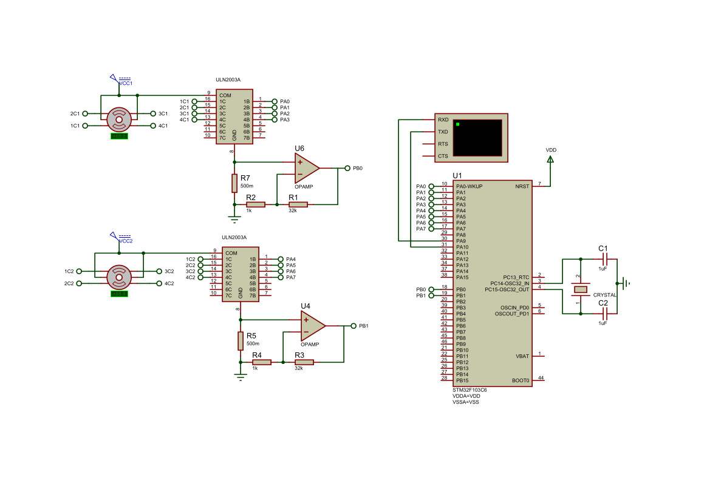
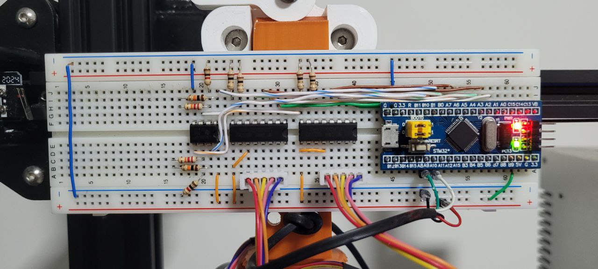

# Proteus

An STM32 is the main microcontroller. This MCU controls two stepper motor
drivers, which, in turn, controls two stepper motors. Furthermore, an ammeter
accompanies each motor driver.

## Material
 - 1x STM32F103C6 (MCU)
 - 2x 28BYJ-48 (Stepper Motor)
 - 2x ULN2003A (Stepper Motor Driver)
 - 1x LM358 (OP-AMP)

## Simplified Schematic 

## Protoboard

## Resources
- https://www.st.com/resource/en/datasheet/stm32f103c6.pdf
- https://www.mouser.com/datasheet/2/758/stepd-01-data-sheet-1143075.pdf
- https://www.st.com/resource/en/datasheet/uln2001.pdf
- https://www.ti.com/lit/ds/symlink/lm158-n.pdf
- https://www.filipeflop.com/wp-content/uploads/2017/07/450xN-4-2.jpg